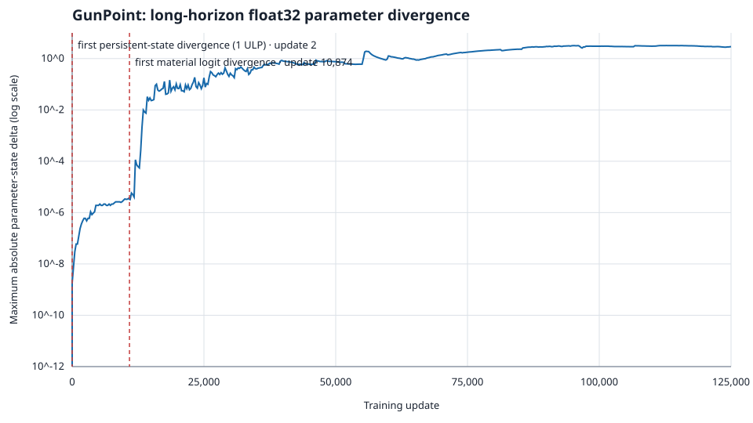

# GunPoint float32 trajectory divergence



This experiment compares the retained model-specific GunPoint oracle with the
canonical semantic compiler in lockstep. It is a numerical-stability case
study, not a claim that one training implementation is more correct.

Both paths use the same ordered dataset, initialization, sample order, labels,
learning rates, epoch schedule, stateless SGD, and mathematically equivalent
binary-classification gradient. The diagnostic canonical path seeds the
classifier affine gradient directly with `sigmoid(logit) - target`; production
compiler arithmetic is not changed.

## Observed boundaries

- The fused and unfused sigmoid/BCE gradients differ on 2,644 of the first
  10,167 updates. Their maximum difference is `1.1920929e-07`, or 2 ULP.
- Persistent state first differs before the second sample: `head[2]` differs by
  1 ULP (`1.86264515e-09`) after the first update.
- The first tolerance-level forward divergence occurs at update 10,874
  (`epoch=217`, `sample=23`). The classifier logit differs by
  `3.86238098e-05` with a `3e-05` tolerance.
- Immediately before that forward pass, the largest absolute parameter delta
  is `3.69548798e-06` in `wq[20]` (62 ULP). Input, QKV, attention, residual,
  LayerNorm, FFN, final encoder output, and pooling remain within tolerance.
  The classifier logit is the first observed amplifier above the threshold.
- There is no optimizer state: both paths use stateless SGD.

Final test accuracy demonstrates that arithmetic form changes the nonlinear
trajectory without establishing a semantic defect:

| Path | Ordered | Shuffled |
| --- | ---: | ---: |
| Oracle | 0.953 | 0.740 |
| Canonical, explicit sigmoid + BCE | 0.827 | 0.860 |
| Canonical diagnostic fused gradient | 0.827 | 0.733 |

The fused form nearly restores the shuffled result but does not restore the
ordered result. Sigmoid/BCE arithmetic is therefore a real trajectory factor,
but not a unique root cause of the final ordered-model difference.

## Reproduce

Set either `GUNPOINT_DIR`, or both `GUNPOINT_TRAIN` and `GUNPOINT_TEST`, then
run:

```sh
scripts/check_gunpoint_numerical_stability.sh
```

The check builds the differential harness, verifies the ULP probe and fixed
boundaries, runs both fused accuracy experiments, and generates a temporary
CSV trace with these columns:

```text
update,epoch,sample,state_max_abs,state_max_ulp,logit_abs,first_numerical,material_divergence
```

The trace records the initial update, the first persistent-state numerical
divergence, every 250th update, and the first material divergence. It makes the
growth of parameter and logit deltas available for plotting without making
bit-identical training a correctness requirement.

The check also renders `stability.svg`: a dependency-free, paper-ready plot
with training update on the x-axis, maximum absolute parameter-state delta on
a logarithmic y-axis, and vertical annotations at updates 2 and 10,874. To
render a retained CSV directly:

```sh
python3 fasm/spikes/plot_gunpoint_stability.py stability.csv stability.svg
```

The checked-in [CSV trace](gunpoint-numerical-stability.csv) and
[SVG figure](gunpoint-numerical-stability.svg) are the evidence produced by the
reference run described above.
