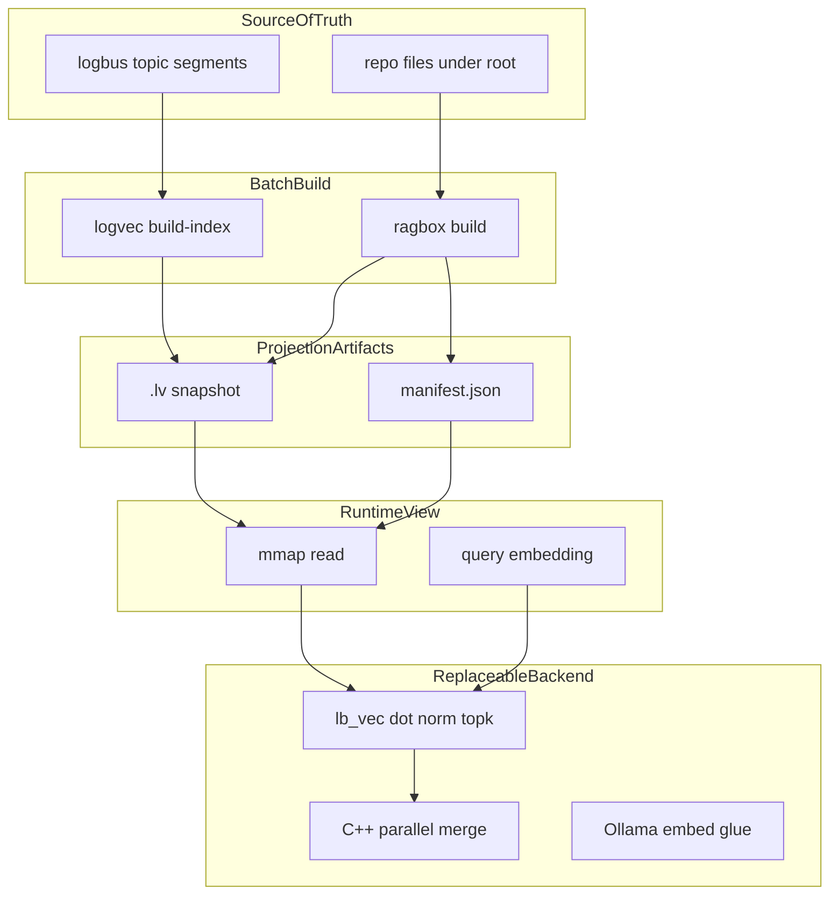

# System form (Level 4)

Canonical architecture spec for the logbus → logvec → ragbox stack inside
`fasm-mac`. Wire formats and CLI live in [`logvec.md`](logvec.md) and
[`ragbox.md`](ragbox.md). FASM leaf contracts live in
[`core_contracts.md`](core_contracts.md) (Levels 1–2).

## Thesis

```text
Local exact semantic snapshot for agents:
truth → build → {vectors.lv, metadata.manifest} → in-process exact query
```

We build **artifact + rebuild story + narrow query API**, not a vector DB
server.

## Why this exists

Agents need a **deterministic semantic snapshot** of a repo or log — something
you build once, copy beside the agent, and query offline.

Properties that matter:

- **Copyable files** — `memory.lv` + manifest travel like SQLite or static assets
- **Versionable** — git diff, checksum, named snapshots
- **Checkable** — `doctor`, fixtures, layered bench
- **No stack tax** — no Python venv, no cloud service, no broker semantics in the index

`fasm-mac` is a **brew-worthy CLI platform**. FASM is a **replaceable math
leaf**, not the system architecture.

## System class

**Local-first derived snapshot system:**

```text
append-only source  →  batch projection  →  mmap query artifact
```



Analogies by **form** (not performance):

| Analog | Shared shape |
|--------|--------------|
| SQLite file | single copyable artifact, offline query |
| Static site generator | source → build → published output |
| Kafka consumer + materialized view | log → projection (logbus path) |
| ripgrep (conceptually) | exact scan over local bytes |

## Invariants

These must stay true across v0.x unless explicitly versioned:

| # | Invariant | Enforced by | Verified by |
|---|-----------|-------------|-------------|
| 1 | `.lv` is derived, never canonical | `build-index` / `ragbox build` recreate it from source | rebuild + search on new artifact |
| 2 | `doc_id` is the stable join key between vectors and metadata | ragbox manifest + logvec index records | `scripts/check_ragbox.sh`, `validateManifestIndex` |
| 3 | `LOGVEC1` wire format or explicit v2 with migration | [`logvec.md`](logvec.md) header spec | `scripts/check_logvec_cpp.sh`, fixture `.lv` |
| 4 | Exact cosine top-k: score desc, `doc_id` asc on ties | FASM kernel + C++ sort | `expected_search.txt`, ragbox expected JSON |
| 5 | logbus stays a dumb durable log — no vector semantics in the broker | [`logvec.md`](logvec.md) Architecture | `scripts/check_logbus.sh` (broker only) |
| 6 | Math backend is replaceable via C ABI (`lb_vec_*`) | [`vector_core.hpp`](../fasm/apps/logvec/vector_core.hpp) | `vec_dot_smoke`, `parallel_search_smoke` |
| 7 | Batch build + incremental `refresh` (file-hash delta); no daemon tail | ragbox CLI | `scripts/check_ragbox.sh` incremental smoke |
| 8 | ragbox = chunk → embed → artifacts, not a monolith server | [`ragbox.md`](ragbox.md) | single binary, no listen port in v0 |

Safe to evolve without breaking the system **form**:

- perf (SIMD, threads, layout, prefetch)
- embed provider (Ollama → other HTTP/local)
- host language (C++ ↔ Zig)
- manifest schema v2 with migration
- optional ANN as a **separate projection mode**, not a replacement for exact
- arm64 / NEON backend slice

## Source of truth

Truth depends on which pipeline you use:

| Path | Source of truth | Projection | Rebuild |
|------|-----------------|------------|---------|
| **A — logbus** | Topic segment files on disk (`.log` + offset index) | `.lv` from `logvec build-index` | `--host` / `--dir` / replay segments |
| **B — ragbox** | Files under `--root` + build params (chunk size, overlap, model) | `memory.lv` + `memory.lv.manifest.json` | `ragbox build --root …` |
| **C — fixtures** | Definitions in `write_fixture.py` / test sources | `fixture.lv` + manifest under fixtures | re-run fixture writer |

**Never source of truth:**

```text
.lv              derived vector snapshot
manifest.json    derived metadata sidecar
mmap mapping     runtime view of .lv
top-k results    query output
Ollama weights   replaceable embed function
```

**Replay rule:** delete projections and rebuild from truth. Chunk boundaries
and `doc_id` assignment must be reproducible. Embedding floats may differ
across model versions or nondeterministic runtimes — that is expected; the
**shape** of the projection (which chunks exist, which `doc_id` maps where)
must not drift silently.

## Projection, cache, backend

| Layer | Role | Examples | Lifetime |
|-------|------|----------|----------|
| **Projection** | Durable derived artifacts | `.lv`, `manifest.json` | Until next rebuild; safe to delete |
| **Cache** | Ephemeral read acceleration | OS page cache over mmap, parsed manifest in RAM, query `f32[dim]` | Process / OS |
| **Backend** | Swappable implementation | FASM `lb_vec_*`, C++ parallel merge, Ollama HTTP | Replaceable at contract boundary |

Level mapping inside this repo:

```text
Level 4 (this doc):  truth, projection, invariants, replaceability
Level 3:             Zig/C++ — files, index I/O, CLI, manifest, parallel orchestration
Level 2:             C ABI — dot, norm, top-k API
Level 1:             FASM/AVX2 (or future NEON) — registers, SIMD loops
```

See [`core_contracts.md`](core_contracts.md) for Level 1–2 FASM routine contracts
(ABI, clobbers) — a different scope from system form.

## Replaceability matrix

### Safe to replace

| Component | Why safe |
|-----------|----------|
| FASM → NEON / Accelerate / scalar C | Same C ABI in `vector_core.hpp` |
| Ollama → other embed HTTP/local | Glue layer; not stored in `.lv` wire format |
| C++ host ↔ Zig host | Same responsibilities per [`logvec.md`](logvec.md) |
| Chunker rules, file extensions | Manifest rebuilds from `--root` |
| Parallel merge strategy | Orchestration only |
| x86_64 ↔ arm64 math slice | Backend object swap at link time |

**arm64 is a backend swap, not a rewrite.** Level 3 hosts (`logvec.cpp`, `ragbox.cpp`,
index I/O, manifest, parallel merge) stay the same. Only the Level 1 object linked
against [`vector_core.hpp`](../fasm/apps/logvec/vector_core.hpp) changes — e.g.
FASM x86_64 `.o` today, NEON `.o` or Accelerate-backed stubs tomorrow. Wire format,
`doc_id` join, and CLI contracts do not move.

C ABI surface (frozen at Level 2, implementation swappable at Level 1):

```text
lb_vec_dot_f32, lb_vec_norm_f32, lb_vec_topk_cosine_lv, lb_vec_topk_cosine_exact
lb_logvec_payload_validate, lb_crc32c
```

| Lite vs embedded manifest `text` | Read path for snippets |
| bench / doctor / check scripts | Observability |

### Frozen without a new system

| Component | Why frozen |
|-----------|------------|
| `.lv` as the vector projection artifact | Entire query path depends on it |
| `doc_id` join semantics | ragbox ↔ logvec contract |
| Exact cosine score definition | Fixtures, expected JSON, bench baselines |
| logbus CRC envelope + payload shape | Ingest parity with `check_logbus.sh` |

## What we are not

- Vector DB server or cloud ANN service
- Realtime daemon / fsnotify tail (v0)
- Distributed or multi-node search
- Billion-vector corpora (exact scan target: agent-scale 1k–100k chunks)
- MCP server, PDF/HTML pipeline (see [`ragbox.md`](ragbox.md) Not in v0)

Positioning in one line:

```text
Portable exact snapshot search, fast enough for local agent memory,
without Python hot path / vector DB / server stack.
```

Performance numbers and bench commands: [`logvec.md`](logvec.md) Performance.

## Open questions (non-commitments)

Future Level 4 work — not promised in v0.x:

- **Manifest v2** — schema migrations, richer provenance
- **Multi-snapshot** — repo memory vs session memory vs tool output as separate artifacts
- **Optional ANN projection** — separate build mode; exact remains default and testable
- **Replay guarantees** — formal spec for embed nondeterminism vs deterministic chunking

## Related

- [`logvec.md`](logvec.md) — `.lv` wire format, ingest, bench
- [`ragbox.md`](ragbox.md) — chunking, manifest, CLI, doctor
- [`core_contracts.md`](core_contracts.md) — FASM Level 1–2 routine contracts
